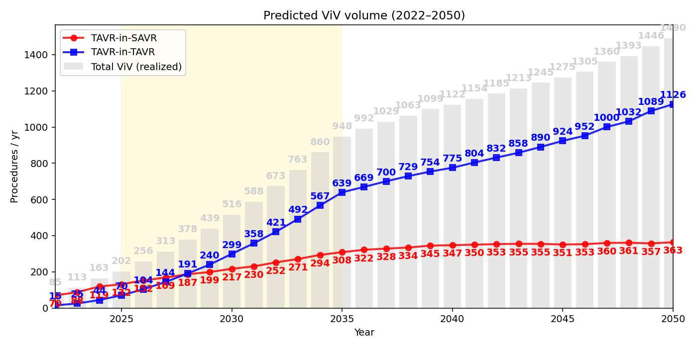
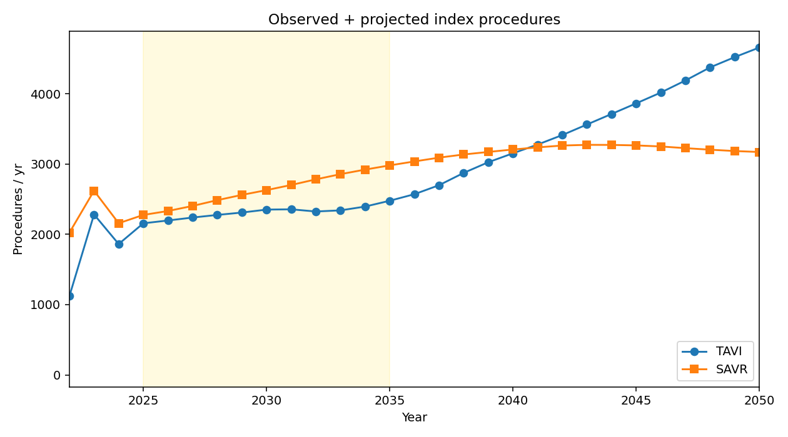
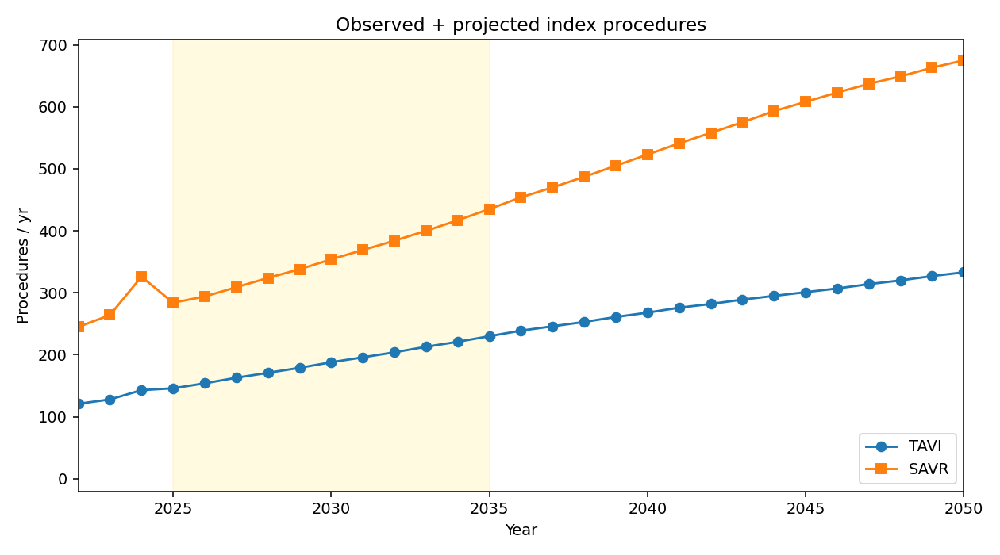
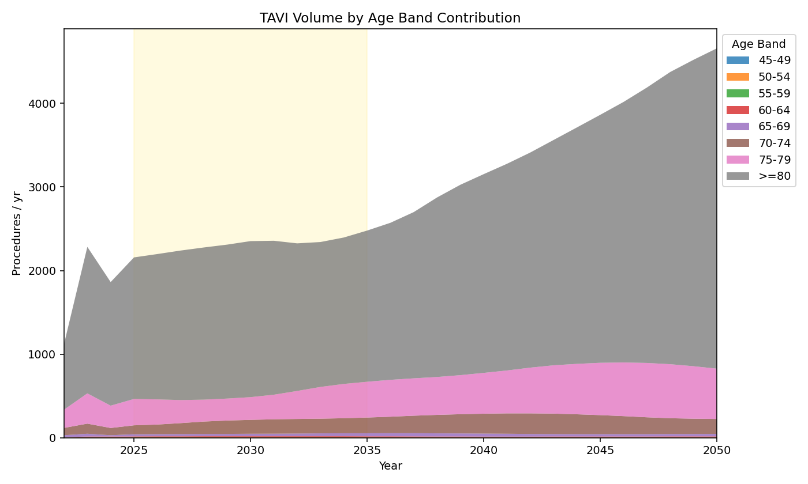
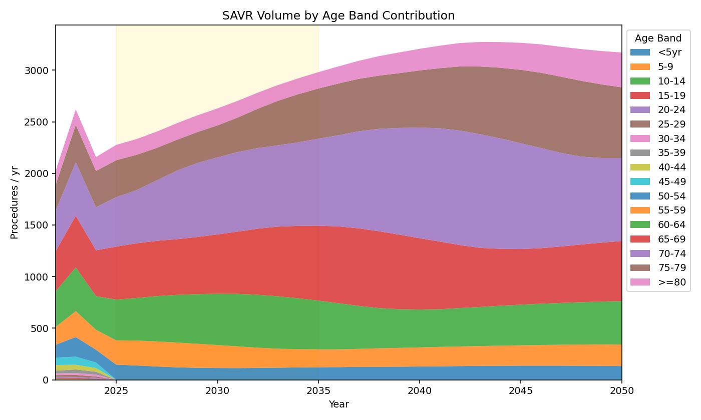
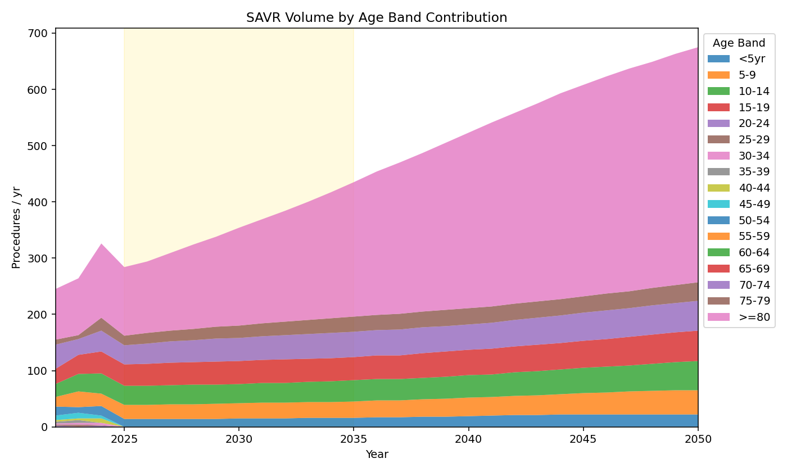

# Model v11 Comparison Report: Korea vs Singapore
Generated on: 2026-01-19 01:02:15

This report compares the projected ViV volume and Index Volume drivers for Korea and Singapore.

## 1. ViV Forecast (Image C)
**Korea** | **Singapore**
--- | ---
 | 

## 2. ViV Candidates vs Realized (Image D)
**Korea** | **Singapore**
--- | ---
 | 

## 3. Index Volume Projection
**Korea** | **Singapore**
--- | ---
 | 

## 4. Demographic Impact on TAVI Volume
**Korea** | **Singapore**
--- | ---
 | 

## 5. Demographic Impact on SAVR Volume
**Korea** | **Singapore**
--- | ---
 | 

## 6. Projected Adoption
**Korea** | **Singapore**
--- | ---
 | 

