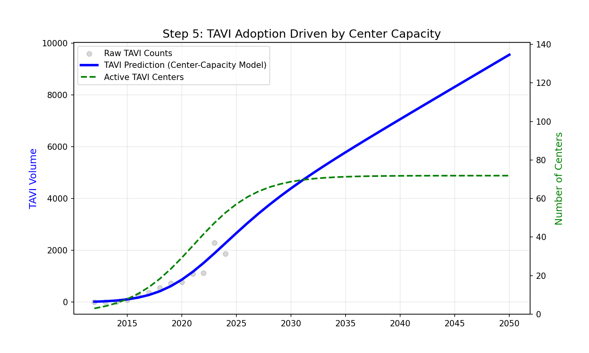
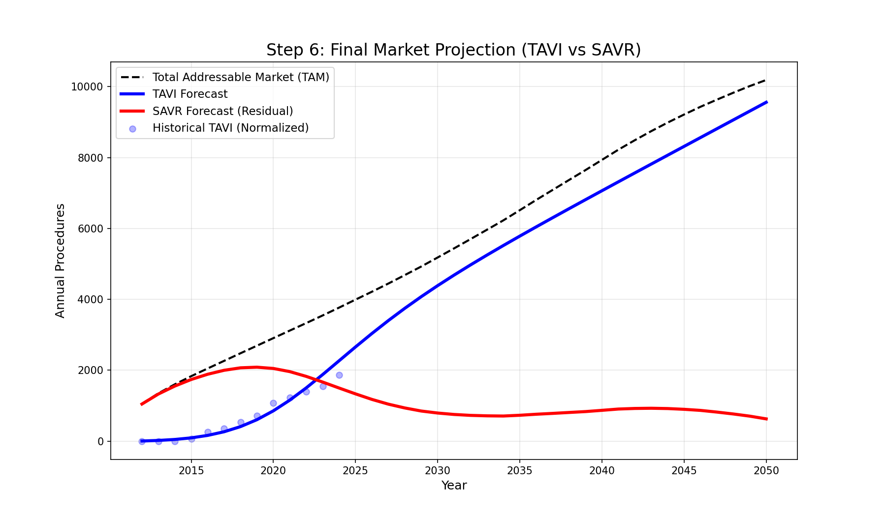

# Projecting Index Procedures of TAVI and SAVR

## Overview

This document details the complete statistical framework used to forecast Transcatheter Aortic Valve Implantation (TAVI) and Surgical Aortic Valve Replacement (SAVR) volumes in South Korea through 2050. The model integrates demographic projections, procedure-specific risk trends, and infrastructure constraints to produce a robust demand-supply forecast.

The code for the final adoption model can be found here:
`simulation_run_v1/models/final_adoption_model.py`

---

## Step 1 & 2: Data Normalization

### Volume-Preserved Trend Redistribution

**Problem**: Raw procedure data exhibits varying volatility during the COVID-19 pandemic window (2020-2023). Direct use of this data introduces noise into long-term trend analysis.

**Methodology**: We apply a **Volume-Preserved Trend Redistribution** to normalize the data. This ensures:

1.  **Shape Consistency**: Normalized data follows the pre-pandemic secular trend (2012–2019).
2.  **Conservation of Volume**: The total number of procedures is preserved (the "spike" in 2023 compensates for the "dip" in previous years).

**Data Overview**

**Normalization Effect**
The plot below demonstrates the effect of this normalization. The Blue Line (Normalized) preserves the area under the curve of the Black Dashed Line (Raw).

---

## Step 3: Age-Stratified Risk Trend Modeling

**Methodology**: We model the "Risk Rate" (procedures per 100,000 population) for each age band using a **Logarithmic Growth Model**.
$$ R*{i}(t) = \alpha*{i} + \beta*{i} \ln(t - t*{0}) $$

**Rationale**: Adoption of a new therapy (TAVI) initially accelerates but eventually decelerates as it approaches the natural saturation limit of the prevalent disease pool (the "Low Hanging Fruit" effect).

**Projected Risk Trends**
Older cohorts (75-79, 80+) show steep initial growth, while younger cohorts show flatter trajectories.

---

## Step 4: Total Addressable Market (TAM) Derivation

**Methodology**: The TAM is calculated by projecting the current risk rates onto the future demographic structure provided by UN Population Projections.
$$ \text{TAM}(t) = \sum \left( P*{i}(t) \times \hat{R}*{i}(t) \right) $$

**Key Insight**: While the _Risk Rate_ saturates (flattens), the _TAM_ grows exponentially. This is driven by the **Demographic Force**: the 80+ population is projected to triple between 2024 and 2050.

**TAM Projection**
Note the correlation between TAM (Black) and the 80+ Population count (Green).

---

## Step 5: Infrastructure-Constrained TAVI Adoption

**Methodology**: TAVI growth is modeled as a function of infrastructure capacity (supply-side constraint), rather than unconstrained diffusion.
$$ F*{tavi}(t) = C(t) \times V*{pc}(t) $$

- **$C(t)$ (Centers)**: Modeled with a Sigmoid growth curve, capped at approx. 94 centers.
- **$V_{pc}(t)$ (Throughput)**: Trends linearly towards a maturity level.

**Result**: TAVI volume decelerates as the number of centers hits saturation.

---

## Step 6: SAVR Residual Calculation

**Methodology**: SAVR volume is calculated as the **Residual Demand**—the difference between the Demographically driven TAM and the Supply-constrained TAVI volume.
$$ S(t) = \max \left( 0, \ TAM(t) - T(t) \right) $$

**Interpretation**: Even if TAVI grows slightly, if the TAM grows _faster_ (due to demographics), SAVR volumes may stabilize or even recover to fill the "Gap" in untreated incidence.

**Final Market Projection**

- **Black Dashed**: TAM (Total Demand)
- **Blue**: TAVI (Supply-Constrained)
- **Red**: SAVR (Residual Gap)

---

## Summary Output

The final volume projections for both procedures:

---

## Next Steps

With the index procedure volumes ($N_{tavi}(t)$, $N_{savr}(t)$) projected, the next step is to use these as inputs for the Monte Carlo simulation to forecast Valve-in-Valve (ViV) TAVI rates.

[**> Proceed to Monte Carlo Projection of ViV TAVI Rates**](../viv_tavi_mc_projection)
