# Forecasting TAVI and SAVR procedure volumes in Asia: a demographic-anchored adoption model addressing socioeconomic determinants of valve-in-valve demand

Charles Yap¹, Hyunjin Ahn², Jeehoon Kang²\*, Jonathan Yap¹\*

¹ National Heart Centre Singapore, Singapore
² Seoul University Hospital
\* Corresponding author.

---

## Summary

**Background**

Accurate forecasting of transcatheter aortic valve implantation (TAVI) and surgical aortic valve replacement (SAVR) volumes is essential for predicting valve-in-valve (ViV) TAVI demand. Ohno et al.⁽¹³⁾ developed a Monte Carlo engine for ViV forecasting in the United States and Japan, but the accompanying editorial⁽¹⁴⁾ identified a critical gap: evolving socioeconomic factors—including changing TAVR-to-SAVR ratios, regional guidelines, and reimbursement models—are not yet accounted for in prediction models. We address this gap by developing a demographically anchored framework that explicitly models both population ageing and TAVI adoption dynamics.

**Methods**

We integrated national registry data (2012–2024), United Nations population projections (to 2050), and a constrained logistic (sigmoid) adoption model into a forecasting pipeline applied to South Korea and Singapore. The model decomposes projected demand into a Total Addressable Market (TAM)—driven by age-stratified procedure risk rates and population ageing—and a TAVI adoption share bounded by a configurable maximum. Projected TAVI and SAVR volumes feed into a 100-run Monte Carlo engine that simulates patient-level valve durability, age-hazard–adjusted survival, and time-varying ViV penetration rates to estimate both ViV candidate pools and realised procedure volumes. Redo-SAVR demand is estimated separately from registry-derived per-capita risk rates applied to the evolving population structure, then subtracted from realised TAVI-in-SAVR volumes. Because the long-term TAVI market share is uncertain, we present two bounding scenarios: a conservative ceiling of L_max = 0·50 (50% TAVI share) and an expanded ceiling of L_max = 0·75 (75% TAVI share).

**Findings**

Total procedural demand (TAM) is projected to grow 2·7-fold in Korea (to 10,189 procedures per year) and 3·4-fold in Singapore (to 1,389) by 2050, driven overwhelmingly by the ≥80 population. The adoption ceiling determines only how this demand is split: under the 50% scenario Korea's TAM divides equally between TAVI and SAVR (5,095 each), whereas under 75% TAVI captures 7,641 and SAVR falls to 2,548. Downstream Monte Carlo simulation projects 2,647–2,959 annual ViV TAVI candidates in Korea and 280–285 in Singapore by 2050, with TAVI-in-TAVI candidates overtaking TAVI-in-SAVR by approximately 2030—consistent with patterns reported by Ohno et al.⁽¹³⁾ in the United States and Japan. After applying time-varying penetration rates and subtracting demographically projected redo-SAVR volumes, net realised ViV TAVI demand remains substantial across all scenarios.

**Interpretation**

Demographic ageing is the dominant long-run driver of aortic valve procedure demand. The TAVI adoption ceiling—a socioeconomic parameter reflecting guidelines, reimbursement, and institutional capacity—determines the TAVI/SAVR split but not total demand. ViV candidate projections confirm that a substantial reintervention burden will emerge from the mid-2030s onward. Incorporating redo-SAVR as a demographically projected competing pathway and time-varying ViV penetration rates enables estimation of net realised ViV demand, moving beyond candidate counts to actionable capacity planning figures. This framework provides an end-to-end pipeline from demographic TAM through index volumes and redo-SAVR estimation to realised ViV procedure forecasting.

**Funding**

None.

---

## Research in context

**Evidence before this study**

We searched PubMed and Embase for studies published up to January 2025 using terms "TAVI OR TAVR" AND "forecast\* OR projection\*" AND "volume OR demand". Ohno et al.⁽¹³⁾ developed the most comprehensive framework to date—a MATLAB-based Monte Carlo engine simulating bioprosthetic valve lifespans across over 4·4 million US and 800,000 Japanese AVR procedures. The accompanying editorial⁽¹⁴⁾ noted that while the global ViV-TAVR trend is expected to surge, the exact trajectory will change with "evolving socioeconomic factors"—including changing TAVR-to-SAVR ratios, regional guidelines, device costs, and reimbursement models—that are not yet incorporated into prediction models. No prior study has applied demographically anchored adoption modelling to Asian TAVI programmes or explicitly parameterised these socioeconomic determinants.

**Added value of this study**

We present a framework that decomposes procedural demand into a demographically driven Total Addressable Market (TAM) and a logistic adoption share, directly addressing the editorial's call for models that account for evolving socioeconomic factors. The configurable adoption ceiling (L_max) captures the net effect of guidelines, reimbursement, and institutional capacity as a single interpretable parameter. Downstream, we extend the ViV modelling pipeline beyond candidate estimation to include time-varying ViV penetration rates and demographically projected redo-SAVR volumes as a competing reintervention pathway—yielding net realised ViV demand estimates. Applied to Korea and Singapore under two bounding scenarios (50% and 75% TAVI ceiling), we demonstrate that total demand growth is demographically determined, while the TAVI/SAVR split is governed by socioeconomic factors—and that SAVR volumes may grow despite TAVI substitution.

**Implications of all the available evidence**

Extending the Ohno et al.⁽¹³⁾ Monte Carlo framework with demographically anchored upstream volume projections provides a more complete ViV forecasting pipeline. Healthcare planners in rapidly ageing Asian populations should not assume that TAVI growth will reduce SAVR demand. The two-scenario approach enables rapid assessment of how socioeconomic policy changes (reimbursement expansion, guideline updates) will affect both procedure volumes and downstream ViV burden.

---

## Introduction

Aortic stenosis (AS) is the most common acquired valvular heart disease in the developed world, affecting 2–7% of adults aged over 65 years and rising to 12·4% in those over 75.⁽¹,²⁾ Without intervention, symptomatic severe AS carries 2-year mortality exceeding 50%.⁽³⁾ For decades, surgical aortic valve replacement (SAVR) was the sole definitive treatment, offering substantial survival benefits in operable patients.

The introduction of transcatheter aortic valve implantation (TAVI) in 2002⁽⁴⁾ fundamentally altered this landscape. The PARTNER and CoreValve programmes established TAVI as non-inferior—and in some populations superior—to SAVR across progressively lower risk categories: high-risk (PARTNER 1, 2010),⁽⁵⁾ intermediate-risk (PARTNER 2, 2016; SURTAVI, 2017),⁽⁶,⁷⁾ and low-risk (PARTNER 3, 2019; Evolut Low Risk, 2019).⁽⁸,⁹⁾ In many Western countries, TAVI now exceeds 50% of all aortic valve interventions.

The Asian context presents unique features. South Korea's ≥65 population is projected to grow from 17% (2022) to 46% (2050)—the fastest ageing rate among OECD nations.⁽¹⁰⁾ The ≥80 cohort will increase 3·0-fold in Korea and 3·6-fold in Singapore between 2024 and 2050. TAVI adoption in Asia has lagged behind the West by 5–10 years, meaning that Asian programmes are currently in their steepest growth phase.

All bioprosthetic valves are subject to structural valve deterioration (SVD), with durability estimated at 10–20 years.⁽¹¹⁾ Valve-in-valve (ViV) TAVI has emerged as the preferred reintervention strategy,⁽¹²⁾ creating growing demand for accurate upstream volume projections. Ohno et al.⁽¹³⁾ recently developed a Monte Carlo engine for ViV forecasting, projecting that ViV procedures will reach approximately 42,000 in the United States and 4,972 in Japan by 2035. Notably, the accompanying editorial by Yoon et al.⁽¹⁴⁾ highlighted that the exact ViV trajectory will depend on "evolving socioeconomic factors" including changing TAVR-to-SAVR ratios, regional guidelines, device costs, and reimbursement models—factors not yet incorporated into prediction models.

The present work directly addresses this gap. We introduce three methodological components that capture the key socioeconomic determinants identified by Yoon et al.: (1) a **demographic distribution shift model** that accounts for population ageing as the primary driver of total procedural demand; (2) an **explicit TAVI adoption model** that parameterises the socioeconomic factors governing the TAVI/SAVR split as a single configurable parameter (L_max); and (3) a **demographically anchored redo-SAVR model** that projects surgical reintervention volumes from registry-derived per-capita risk rates, enabling estimation of net realised ViV TAVI demand after accounting for patients diverted to open redo surgery. Because the ultimate TAVI market share is uncertain—depending on long-term trial data, guideline evolution, and reimbursement policy—we present results under two bounding scenarios (L_max = 0·50 and L_max = 0·75).

---

## Methods

### Data sources

Three data categories were used: (1) national registry TAVI, SAVR, and redo-SAVR procedure counts by five-year age band (50–54 to ≥80) and sex—from Korea's HIRA database and Singapore's national cardiac registry (2012–2024); (2) United Nations World Population Prospects (2024 revision) providing sex-specific projections to 2050;⁽¹⁰⁾ and (3) configurable model parameters, principally the maximum TAVI adoption share (L_max).

### Age-band harmonisation

UN five-year population bands (80–84, 85–89, …, 100+) were aggregated into a single ≥80 band to match registry schema. Bands 50–54 through 75–79 mapped directly.

### Pandemic-period redistribution (step 2)

COVID-19 distorted the 2020–2023 data. We applied a volume-preserved redistribution satisfying two constraints: (1) the normalised series follows the pre-pandemic linear trend (T(t) = α + βt, fitted to t ≤ 2019); and (2) total volume is conserved. The scaling factor is:

$$\kappa = \frac{\sum_{t \in W} O(t)}{\sum_{t \in W} T(t)}$$

where W = {2020, 2021, 2022, 2023}. Normalised values are N(t) = κ · T(t) for t ∈ W.

### Age-stratified risk rate projection (step 3)

The procedure risk rate R_i(t) for age band i is:

$$R_i(t) = \frac{N_{\text{TAVI},i}(t) + N_{\text{SAVR},i}(t)}{P_i(t)}$$

Normalised rates are projected using a logarithmic saturation model:

$$\hat{R}_i(t) = a_i + b_i \cdot \ln(t - 2010)$$

with parameters estimated by Levenberg–Marquardt fitting.

### Total Addressable Market (step 4)

$$\text{TAM}(t) = \sum_{i \in \mathcal{B}} P_i(t) \cdot \hat{R}_i(t)$$

where B spans 50–54 to ≥80. The TAM is identical across both scenarios, as it represents total demand irrespective of modality.

### TAVI adoption modelling (step 5)

Adoption is modelled with a constrained sigmoid:

$$\hat{S}_{\text{TAVI}}(t) = \frac{L_{\max}}{1 + e^{-k(t - t_0)}}$$

where L_max is the maximum TAVI share of TAM. Parameters k and t₀ are fitted to historical share data from 2016 onwards. We present two scenarios:

- **Scenario A (L_max = 0·50):** Conservative ceiling reflecting current clinical practice where SAVR retains a substantial role for complex anatomies and younger patients.
- **Scenario B (L_max = 0·75):** Expanded ceiling reflecting potential guideline evolution, favourable long-term TAVI data, and broader indications.

### Volume decomposition (step 6)

$$\hat{N}_{\text{TAVI}}(t) = \hat{S}_{\text{TAVI}}(t) \cdot \text{TAM}(t)$$

$$\hat{N}_{\text{SAVR}}(t) = \max\bigl(0,\; \text{TAM}(t) - \hat{N}_{\text{TAVI}}(t)\bigr)$$

### Downstream Monte Carlo simulation of ViV candidates

TAVI and SAVR volume projections serve as inputs to a patient-level Monte Carlo engine that estimates both the annual pool of ViV TAVI candidates and realised ViV procedures. The simulation architecture is analogous to the framework of Ohno et al.⁽¹³⁾ but extends it with age-hazard–adjusted survival, time-varying ViV penetration rates, and demographically anchored redo-SAVR subtraction.

#### Patient-level sampling

For each projected index procedure (TAVI or SAVR) in calendar year Y, the engine samples four patient-level variables:

- **Patient age**: drawn uniformly within the five-year registry age band (e.g. 50–54).
- **Risk category**: sampled from period-specific risk-mix distributions. TAVI risk shares evolve over time to reflect expanding indications (e.g. a higher low-risk proportion from 2025 onward); SAVR risk shares are held constant.
- **Survival time**: drawn from a Normal distribution parameterised by risk category (μ_low = 11·0, σ_low = 3·0 years; μ_int/high = 6·0, σ_int/high = 2·0 years). An age-hazard adjustment scales survival inversely with patient age:

$$S_{\text{adj}} = \frac{S_{\text{base}}}{h^{(a - a_{\text{ref}})/5}}$$

where h is the hazard ratio per five-year increment above reference age a_ref. Survival is clamped to ≥ 0·1 years.

- **Valve durability**: TAVI valves are sampled from a two-component Normal mixture reflecting early failure (μ = 4·0, σ = 1·5 years, weight 0·2) and late failure (μ = 11·5, σ = 3·5 years, weight 0·8) modes. SAVR bioprosthetic valves use age-stratified distributions: μ = 10·0, σ = 5·0 years for patients <70, and μ = 17·0, σ = 5·0 years for patients ≥70. Minimum durability is enforced at 1·0 year.

#### Per-run stochastic jitter

To capture inter-run variability beyond patient-level sampling, each Monte Carlo run applies multiplicative jitter to three quantities. Durability is scaled by N(1·0, 0·05), survival by N(1·0, 0·03), and penetration by N(1·0, 0·10), with all factors clamped to [0·2, 5·0] (durability and survival) or [0·0, 2·0] (penetration). This produces realistic inter-run dispersion without altering the mean.

#### Candidate classification

Event-year discretisation assigns Y_fail = Y + ⌊durability⌋ and Y_death = Y + ⌊survival⌋. A patient is classified as a **ViV TAVI candidate** if:

$$Y_{\text{fail}} \leq Y_{\text{death}} \quad \text{and} \quad Y_{\text{sim\_start}} \leq Y_{\text{fail}} \leq Y_{\text{end}}$$

Candidates are classified as **TAVI-in-TAVI** (index was TAVI) or **TAVI-in-SAVR** (index was SAVR).

#### ViV penetration and realised procedures

Not all candidates proceed to ViV TAVI. Time-varying penetration rates π(t) govern the probability that a candidate receives ViV reintervention. Penetration is specified at anchor years and linearly interpolated (e.g. TAVI-in-TAVI: 10% in 2022 ramping to 60% by 2035; TAVI-in-SAVR: 60% to 80% over the same period). For each candidate, a Bernoulli draw with probability π(t) determines whether the candidate becomes a realised ViV procedure. We report both candidate volumes (the structural demand ceiling) and realised volumes (the expected procedural workload) in our results.

### Redo-SAVR estimation

A subset of patients with structural valve deterioration will undergo redo open surgical aortic valve replacement rather than ViV TAVI. We model this using demographically projected absolute redo-SAVR targets derived from national registry data.

#### Per-capita redo-SAVR risk

Observed redo-SAVR counts (from the HIRA database for Korea and national cardiac registry for Singapore, 2012–2024) are stratified by sex and five-year age band. Per-capita redo-SAVR risk rates are computed as:

$$R_{\text{redo},i,s}(t) = \frac{N_{\text{redo},i,s}(t)}{P_{i,s}(t)}$$

where i indexes age band, s indexes sex, and P is the UN-projected population. Risk rates are averaged across reference years (2023–2024) to smooth annual fluctuations.

#### Absolute redo-SAVR target projection

Future redo-SAVR volumes are projected by applying these per-capita risk rates to the evolving population structure:

$$\hat{N}_{\text{redo}}(t) = \sum_{i \in \mathcal{B}} \sum_{s \in \{M,F\}} \bar{R}_{\text{redo},i,s} \cdot P_{i,s}(t)$$

where R̄_redo,i,s is the average per-capita risk. This produces absolute yearly redo-SAVR counts that grow with population ageing independently of the Monte Carlo simulation.

#### Integration with ViV estimates

In the post-processing step, absolute redo-SAVR targets are subtracted from the TAVI-in-SAVR realised volumes to yield net ViV TAVI demand:

$$\hat{N}_{\text{ViV,net}}^{\text{TiS}}(t) = \max\bigl(0,\; \hat{N}_{\text{ViV,realised}}^{\text{TiS}}(t) - \hat{N}_{\text{redo}}(t)\bigr)$$

This approach replaces per-event redo-SAVR probability draws (which would require uncertain assumptions about individual patient routing) with demographically grounded aggregate estimates, ensuring that the redo-SAVR trajectory reflects the same population ageing dynamics that drive index volumes.

### Simulation aggregation

The simulation is repeated over 100 independent runs (seed-controlled for reproducibility), with per-run totals aggregated by year and ViV type. Mean and standard deviation across runs are reported. Each of the four index projection scenarios (two countries × two L_max values) produces a distinct ViV candidate and realised procedure trajectory.

### Software

The pipeline is implemented in Python 3 using NumPy, SciPy, and pandas, with all parameters specified in YAML configuration files. Matplotlib is used for visualisation.

---

## Results

### Historical volumes

Table 1 shows procedure volumes at selected years. Korea's TAVI programme grew 31-fold (61 to 1,862) in nine years; Singapore's grew 4·8-fold (30 to 143) over twelve years.

**Table 1: Historical procedure counts (selected years)**

| Year | South Korea TAVI | South Korea SAVR | South Korea Total | Singapore TAVI | Singapore SAVR | Singapore Total |
|------|-----------------|-----------------|-------------------|---------------|---------------|-----------------|
| 2012 | 0 | 1,531 | 1,531 | 30 | 14 | 44 |
| 2016 | 260 | 2,179 | 2,439 | 52 | 216 | 268 |
| 2020 | 763 | 2,195 | 2,958 | 95 | 208 | 303 |
| 2024 | 1,862 | 2,158 | 4,020 | 143 | 326 | 469 |

### Pandemic redistribution

Korea's scaling factor was κ = 1·071 (7·1% above trend), reflecting pent-up demand. Singapore's was κ = 0·734 (26·6% below trend), consistent with stringent circuit-breaker measures.

### Total Addressable Market

The TAM—identical across both scenarios—is projected to grow 2·7-fold in Korea (3,768 to 10,189) and 3·4-fold in Singapore (413 to 1,389) between 2024 and 2050 (Table 2). The ≥80 cohort drives this expansion, contributing approximately 60% of TAM by 2050 in both countries.

**Table 2: Projected Total Addressable Market and ≥80 cohort contribution**

| Year | Korea TAM | Korea ≥80 | Korea Share | Singapore TAM | Singapore ≥80 | Singapore Share |
|------|-----------|-----------|-------------|---------------|---------------|-----------------|
| 2024 | 3,768 | 1,269 | 33·7% | 413 | 176 | 42·6% |
| 2030 | 5,182 | 1,948 | 37·6% | 606 | 286 | 47·3% |
| 2040 | 7,935 | 3,908 | 49·2% | 1,004 | 578 | 57·5% |
| 2050 | 10,189 | 6,178 | 60·6% | 1,389 | 835 | 60·1% |

**Figure 1: Projected Total Addressable Market (TAM) for aortic valve procedures, 2012–2050, decomposed by age-band contribution. The ≥80 cohort (dark shading) dominates long-term growth in both countries.**

| South Korea | Singapore |
|:-----------:|:---------:|
| 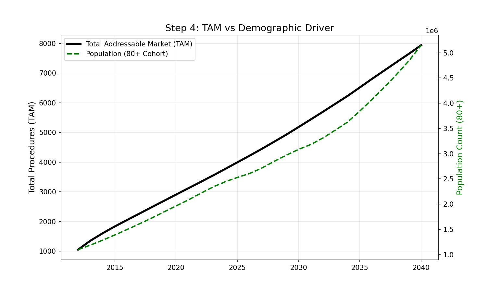 | 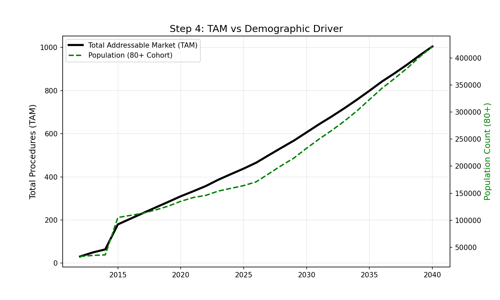 |

### TAVI adoption sigmoid

Table 3 presents the fitted sigmoid parameters under both scenarios. The growth rate k and inflection point t₀ shift modestly between scenarios, but the qualitative pattern is preserved: Korea shows steep adoption approaching saturation by 2024, while Singapore shows a more gradual trajectory.

**Table 3: Sigmoid parameters for TAVI share of TAM under two scenarios**

| Parameter | Korea L_max=0·50 | Korea L_max=0·75 | Singapore L_max=0·50 | Singapore L_max=0·75 |
|-----------|-----------------|-----------------|---------------------|---------------------|
| k (growth rate) | 0·502 | 0·325 | 0·096 | 0·093 |
| t₀ (inflection) | 2018·4 | 2020·5 | 2015·1 | 2017·8 |
| Share at 2024 | 47·1% | 53·8% | 35·1% | 35·2% |

**Figure 2: TAVI adoption as a proportion of TAM: observed data (points) and fitted sigmoid curves (lines) under 50% and 75% ceiling scenarios for both countries.**

| South Korea (L_max=0·50) | South Korea (L_max=0·75) |
|:------------------------:|:------------------------:|
| 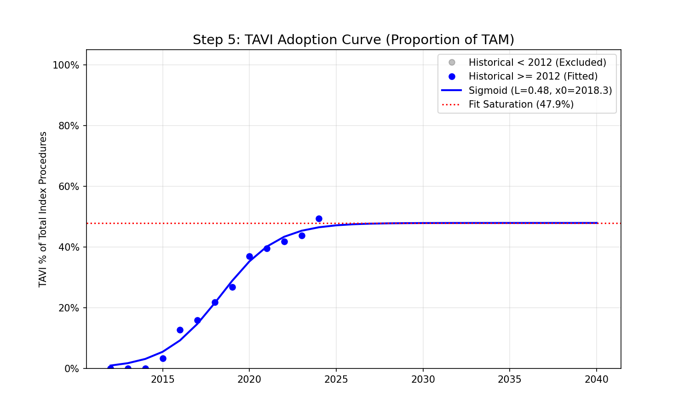 | 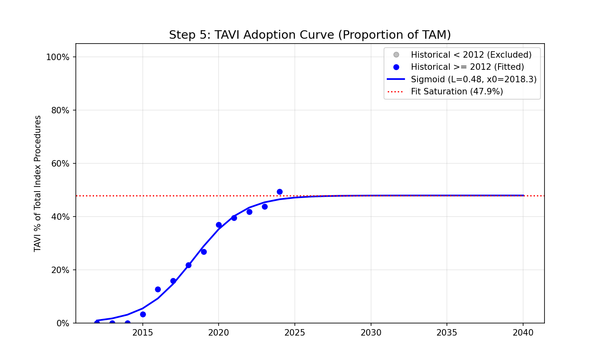 |

| Singapore (L_max=0·50) | Singapore (L_max=0·75) |
|:----------------------:|:----------------------:|
| 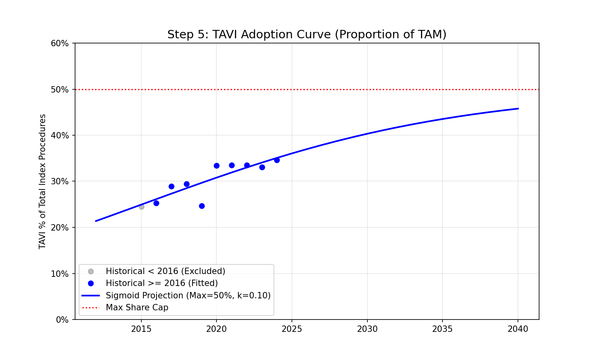 | 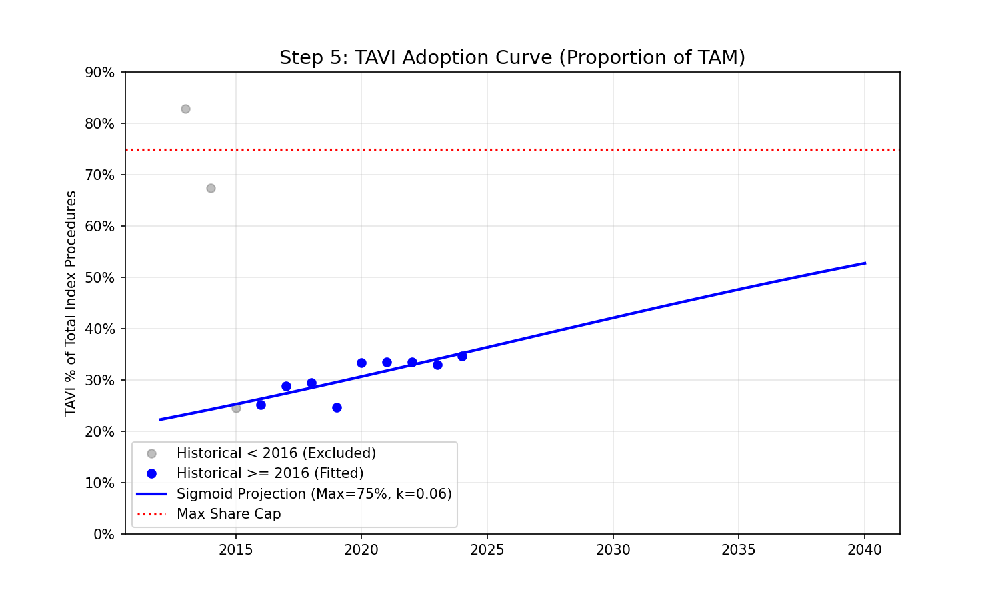 |

### TAVI and SAVR volume forecasts

Table 4 presents the central results: projected TAVI and SAVR volumes under both scenarios.

**Table 4: Projected TAVI and SAVR volumes under two adoption ceiling scenarios**

| Year | Korea TAVI (50%) | Korea SAVR (50%) | Korea TAVI (75%) | Korea SAVR (75%) | Singapore TAVI (50%) | Singapore SAVR (50%) | Singapore TAVI (75%) | Singapore SAVR (75%) |
|------|-----------------|-----------------|-----------------|-----------------|---------------------|---------------------|---------------------|---------------------|
| 2024 | 1,803 | 1,965 | 2,028 | 1,740 | 145 | 268 | 145 | 268 |
| 2030 | 2,587 | 2,595 | 3,687 | 1,495 | 244 | 362 | 255 | 351 |
| 2035 | 3,258 | 3,258 | 4,837 | 1,679 | 348 | 451 | 381 | 418 |
| 2040 | 3,967 | 3,967 | 5,939 | 1,996 | 460 | 544 | 530 | 474 |
| 2050 | 5,095 | 5,095 | 7,641 | 2,548 | 670 | 718 | 848 | 540 |

**Figure 3: Final TAVI and SAVR volume projections under 50% and 75% adoption ceiling scenarios. Shaded areas represent the range between scenarios. Under 50%, SAVR grows alongside TAVI; under 75%, SAVR volumes plateau and begin to decline in Singapore.**

| South Korea (L_max=0·50) | South Korea (L_max=0·75) |
|:------------------------:|:------------------------:|
| 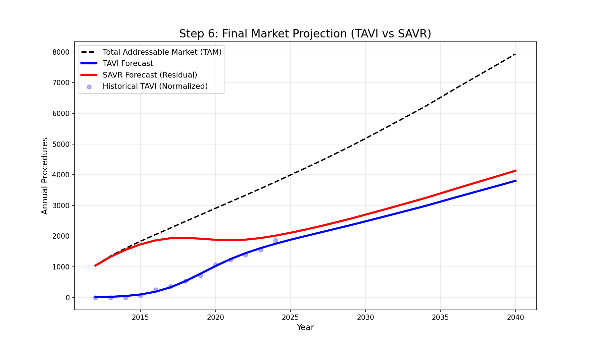 | 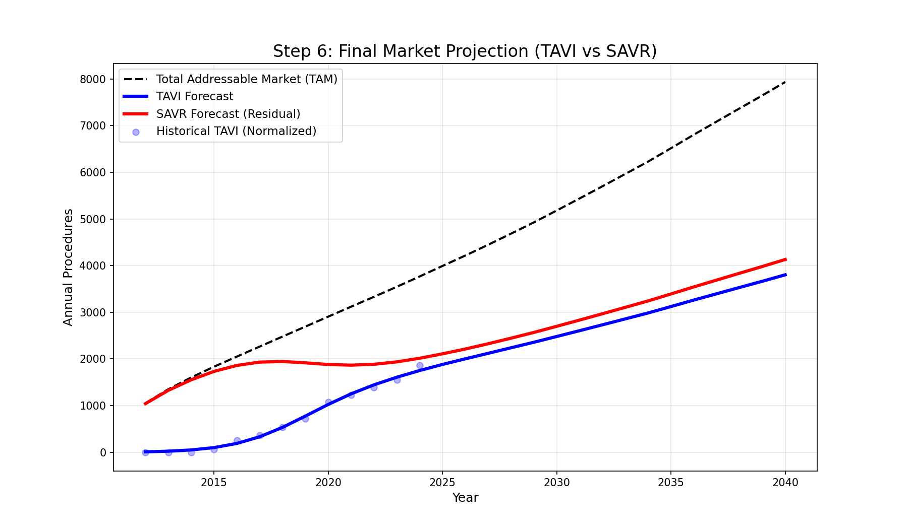 |

| Singapore (L_max=0·50) | Singapore (L_max=0·75) |
|:----------------------:|:----------------------:|
| 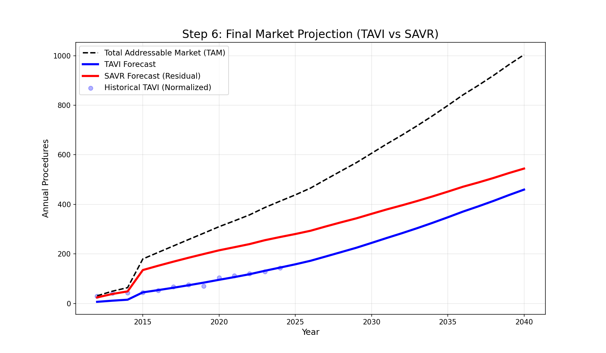 | 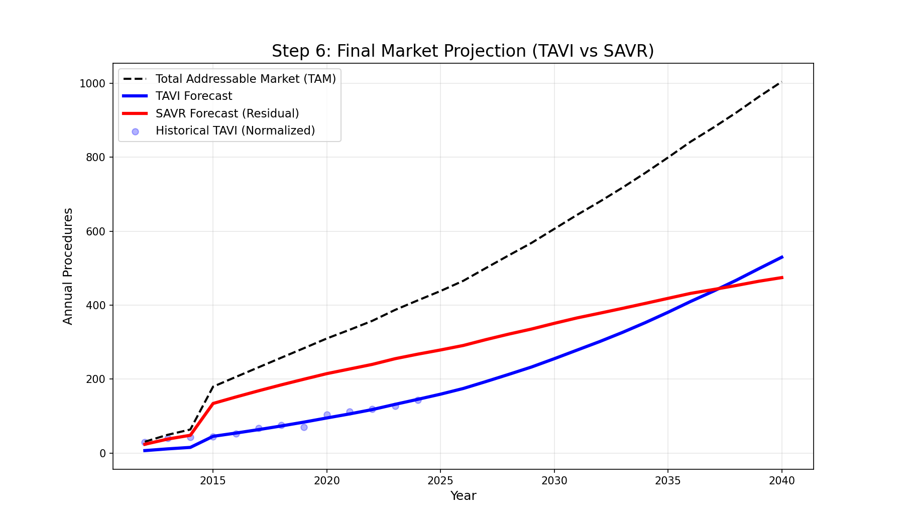 |

Several key findings emerge from the dual-scenario analysis:

1. **Total demand is scenario-invariant.** TAM is identical across both scenarios—10,189 (Korea) and 1,389 (Singapore) by 2050—because it is determined entirely by demographics and age-specific risk rates. The adoption ceiling governs only the split, not total demand.

2. **SAVR trajectory depends critically on L_max.** Under 50%, SAVR grows 2·6-fold in Korea (1,965 to 5,095) and 2·7-fold in Singapore (268 to 718). Under 75%, SAVR grows modestly in Korea (1,740 to 2,548; 1·5-fold) and *declines* in Singapore (268 to 540). This divergence has direct implications for surgical workforce planning.

3. **Korea reaches equilibrium faster.** Korea's steep sigmoid reaches the adoption ceiling by ~2025 (50%) or ~2030 (75%). Singapore's gradual curve does not approach equilibrium until ~2040 (50%) or later (75%).

4. **The 50–75% range bounds a clinically plausible uncertainty interval.** 50% reflects current practice where SAVR retains a dominant role for younger patients, complex anatomies, and systems with conservative guidelines. 75% reflects a future where long-term trial data confirm TAVI durability and indications expand to include most AS patients.

### ViV TAVI candidate projections

Table 5 presents the downstream Monte Carlo estimates of annual ViV TAVI candidates under both scenarios. Figure 4 illustrates the trajectories. Candidate counts represent the structural demand ceiling—patients whose valves have failed while still alive—before application of penetration rates and redo-SAVR subtraction.

**Table 5: Projected annual ViV TAVI candidates by type and adoption scenario**

| Year | Korea TiS (50%) | Korea TiT (50%) | Korea TiS (75%) | Korea TiT (75%) | Singapore TiS (50%) | Singapore TiT (50%) | Singapore TiS (75%) | Singapore TiT (75%) |
|------|----------------|----------------|----------------|----------------|--------------------|--------------------|--------------------|--------------------|
| 2025 | 555 | 325 | 553 | 324 | 44 | 31 | 46 | 31 |
| 2030 | 685 | 684 | 578 | 814 | 88 | 48 | 87 | 50 |
| 2035 | 661 | 920 | 428 | 1,259 | 99 | 62 | 96 | 64 |
| 2040 | 740 | 1,097 | 400 | 1,617 | 104 | 81 | 96 | 90 |
| 2045 | 885 | 1,374 | 454 | 2,042 | 120 | 109 | 104 | 128 |
| 2050 | 1,026 | 1,621 | 517 | 2,442 | 141 | 139 | 116 | 169 |
| **Total (2050)** | **2,647** | | **2,959** | | **280** | | **285** | |

TiS = TAVI-in-SAVR candidates; TiT = TAVI-in-TAVI candidates. Totals refer to 2050 annual values.

**Figure 4: Projected annual ViV TAVI candidates (TAVI-in-SAVR and TAVI-in-TAVI) under 50% and 75% adoption ceiling scenarios. In both countries and scenarios, TAVI-in-TAVI candidates overtake TAVI-in-SAVR candidates by approximately 2030, with the crossover occurring earlier under the 75% scenario due to faster TAVI index volume accumulation.**

| South Korea (L_max=0·50) | South Korea (L_max=0·75) |
|:------------------------:|:------------------------:|
| 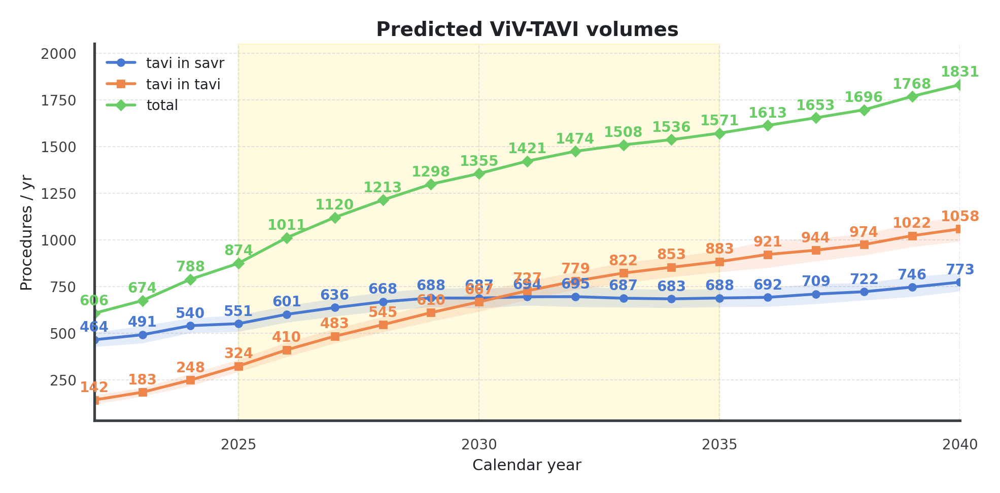 | 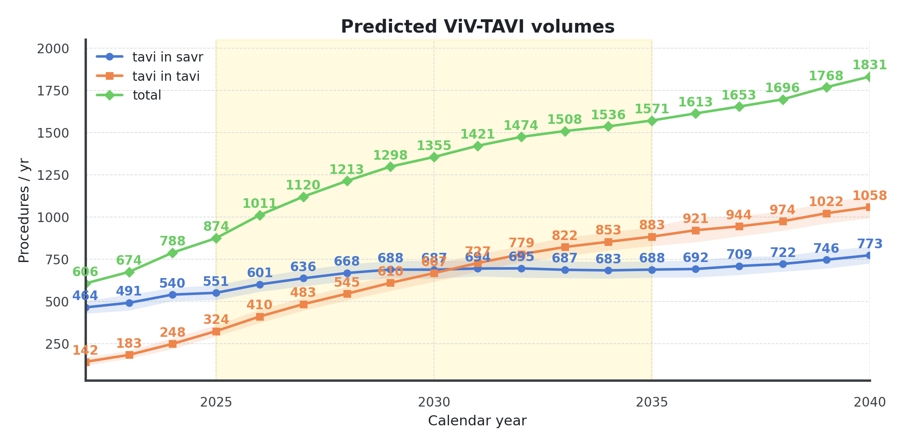 |

| Singapore (L_max=0·50) | Singapore (L_max=0·75) |
|:----------------------:|:----------------------:|
| 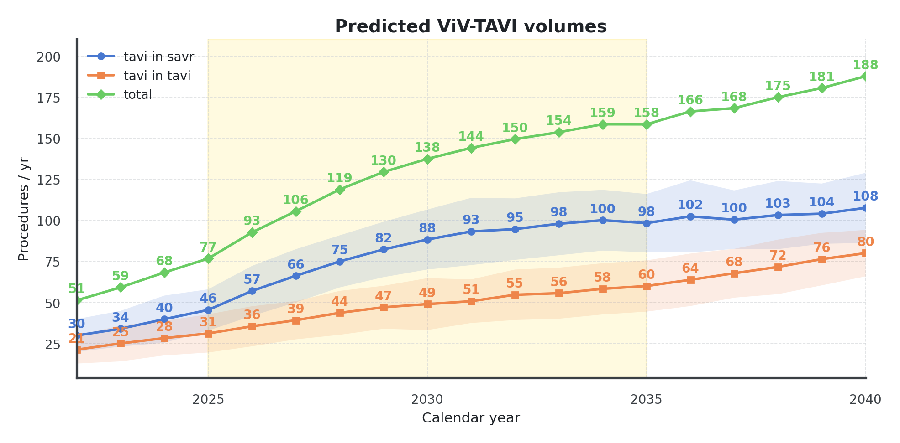 | 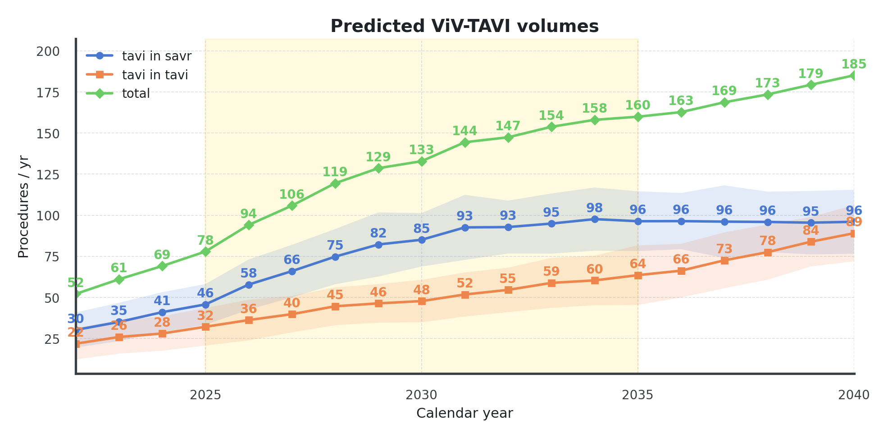 |

Key findings from the ViV candidate analysis:

1. **TAVI-in-TAVI overtakes TAVI-in-SAVR by ~2030.** This crossover is consistent with Ohno et al.'s⁽¹³⁾ findings in the United States and Japan, where TAVI-in-TAVI was projected to dominate by the early 2030s. The similarity across geographies reflects the shared valve durability characteristics rather than country-specific adoption patterns.

2. **Total candidates are moderately higher under 75%.** Korea: 2,959 vs 2,647 (+12%) by 2050; Singapore: 285 vs 280 (+2%). The increase is driven primarily by TAVI-in-TAVI candidates (more TAVI index implants produce more TAVI valve failures), partially offset by fewer TAVI-in-SAVR candidates (fewer SAVR implants).

3. **The composition shifts substantially.** Under 50%, the 2050 split is approximately 39:61 (TiS:TiT) in Korea and 50:50 in Singapore. Under 75%, it shifts to 17:83 in Korea and 41:59 in Singapore, reflecting the larger cumulative TAVI pool.

4. **Candidate volumes grow continuously through 2050.** Unlike the adoption sigmoid which saturates, the candidate pool continues to grow because the cumulative stock of implanted bioprostheses expands year-on-year. This confirms that ViV demand will be a sustained and growing challenge, not a transient phenomenon.

---

## Discussion

This study presents a demographically anchored forecasting framework for TAVI and SAVR volumes, applied to two Asian healthcare systems under two adoption scenarios. The work directly responds to the editorial by Yoon et al.,⁽¹⁴⁾ which called for forecasting models that account for evolving socioeconomic factors—specifically the changing TAVR-to-SAVR ratio, regional guidelines, and reimbursement models.

Our principal contribution is methodological: separating the forecast into a **demographically determined denominator** (TAM) and a **socioeconomically governed numerator** (adoption share). This decomposition makes explicit the interaction identified by the editorial:

$$\hat{N}_{\text{TAVI}}(t) = \underbrace{\hat{S}_{\text{TAVI}}(t)}_{\text{Socioeconomic}} \times \underbrace{\text{TAM}(t)}_{\text{Demographic}}$$

The L_max parameter functions as a single knob that encapsulates the net effect of the socioeconomic determinants Yoon et al. highlighted: guideline conservatism lowers L_max; reimbursement expansion raises it; device cost reductions raise it; SVD concerns lower it. By running scenarios at different L_max values, planners can systematically assess how each factor would affect volume trajectories.

### Relationship to Ohno et al.

Our framework extends the Monte Carlo engine of Ohno et al.⁽¹³⁾ in three respects. First, whereas Ohno et al. take index procedure volumes as exogenous inputs, our framework provides those upstream volumes as demographically grounded, scenario-specific projections. The combined pipeline—demographic TAM → sigmoid adoption → index volumes → Monte Carlo ViV simulation—creates a fully integrated forecasting system in which socioeconomic assumptions propagate consistently from index procedures through to ViV estimation.

Second, we explicitly model the distinction between ViV *candidates* (patients whose valves have structurally deteriorated while still alive) and *realised* ViV procedures (candidates who actually undergo reintervention). This is achieved through time-varying penetration rates that reflect the expected growth in ViV adoption over the projection horizon. Reporting both quantities gives planners both the structural demand ceiling and the expected procedural workload.

Third, we incorporate redo-SAVR as a competing reintervention pathway. Rather than applying per-patient redo-SAVR probabilities (which would require uncertain assumptions about individual routing decisions), we project absolute redo-SAVR volumes from registry-derived per-capita risk rates applied to the evolving population structure. These are subtracted from realised TAVI-in-SAVR volumes, yielding net ViV TAVI demand. This approach ensures that the redo-SAVR trajectory is anchored to the same demographic dynamics that drive index volumes.

The application to Korea and Singapore extends the geographic scope of ViV forecasting to East and Southeast Asian markets not covered by the US–Japan analysis. The TAVI-in-TAVI crossover timing (~2030) is consistent between our Asian projections and the US/Japan results of Ohno et al., suggesting that valve durability—rather than adoption dynamics—is the primary determinant of ViV composition.

### Clinical implications of dual-scenario analysis

The divergence between 50% and 75% scenarios has concrete implications for both surgical workforce and ViV planning:

- **Under 50%**: SAVR demand grows 2·6–2·7-fold by 2050. Cardiac surgical training programmes and operating theatre capacity must *expand*. ViV candidates reach 2,647 (Korea) and 280 (Singapore) annually, with a balanced TiS/TiT composition.
- **Under 75%**: SAVR demand grows modestly (Korea) or declines (Singapore), but remains substantial. ViV candidates are moderately higher (2,959 and 285), but the composition shifts heavily toward TAVI-in-TAVI (83% of Korean candidates by 2050), which has different procedural complexity implications.
- **Total ViV burden grows regardless of scenario**: The 50–75% range produces only a 2–12% difference in total ViV candidates, because the increase in TAVI-in-TAVI failures is largely offset by fewer SAVR failures. The total reintervention burden is therefore primarily determined by demographics, not the adoption pathway.

### The demographic multiplier

Even if TAVI adoption froze at current levels, index volumes would grow 2–3× by 2050 solely from population ageing. The downstream effect is amplified: ViV candidates grow from ~600 to ~2,700 in Korea over the same period, because the cumulative stock of implanted bioprostheses expands year-on-year while valve durability remains biologically constrained. This finding underscores that ViV demand is not merely a consequence of TAVI adoption but a structural demographic phenomenon.

### Limitations

The model uses a fixed L_max for each scenario rather than a time-varying ceiling. The TAM projection is deterministic. The model operates at national level without sub-national heterogeneity. Risk rates capture both incidence and treatment propensity as a single variable. With 9–12 years of data, out-of-sample validation is constrained. The Monte Carlo engine assumes current-generation valve durability distributions; improvements in valve technology could reduce future ViV candidate rates. The redo-SAVR projection assumes that per-capita redo-SAVR risk rates remain stable at 2023–2024 levels; changes in surgical technique or patient selection could alter these rates. Penetration rate assumptions for ViV adoption are informed by current trends but are inherently uncertain over a 25-year horizon.

### Conclusion

We present an end-to-end forecasting framework that links demographically anchored index volume projections to downstream ViV estimation—including both candidate pools and realised procedure volumes after redo-SAVR subtraction—explicitly parameterising the socioeconomic determinants identified by Yoon et al.⁽¹⁴⁾ as missing from prior models. Applied to Korea and Singapore under bounding scenarios, the framework reveals that: (1) total index demand is demographically determined (2·7–3·4× growth by 2050); (2) the TAVI/SAVR split is governed by the adoption ceiling; (3) ViV TAVI candidates will reach 2,647–2,959 annually in Korea and 280–285 in Singapore by 2050, with TAVI-in-TAVI dominating by the early 2030s; and (4) redo-SAVR, modelled as a demographically anchored competing pathway, provides a principled adjustment from candidate counts to net realised ViV demand. The framework provides a transparent, scenario-based platform for integrated capacity planning across index procedures, reinterventions, and surgical reoperations.

---

## References

1. Osnabrugge RLJ, Mylotte D, Head SJ, et al. Aortic stenosis in the elderly: disease prevalence and number of candidates for transcatheter aortic valve replacement. *J Am Coll Cardiol* 2013; **62**: 1002–12.
2. Nkomo VT, Gardin JM, Skelton TN, et al. Burden of valvular heart diseases: a population-based study. *Lancet* 2006; **368**: 1005–11.
3. Ross J, Braunwald E. Aortic stenosis. *Circulation* 1968; **38**: 61–7.
4. Cribier A, Eltchaninoff H, Bash A, et al. Percutaneous transcatheter implantation of an aortic valve prosthesis for calcific aortic stenosis. *Circulation* 2002; **106**: 3006–8.
5. Smith CR, Leon MB, Mack MJ, et al. Transcatheter versus surgical aortic-valve replacement in high-risk patients. *N Engl J Med* 2011; **364**: 2187–98.
6. Leon MB, Smith CR, Mack MJ, et al. Transcatheter or surgical aortic-valve replacement in intermediate-risk patients. *N Engl J Med* 2016; **374**: 1609–20.
7. Reardon MJ, Van Mieghem NM, Popma JJ, et al. Surgical or transcatheter aortic-valve replacement in intermediate-risk patients. *N Engl J Med* 2017; **376**: 1321–31.
8. Mack MJ, Leon MB, Thourani VH, et al. Transcatheter aortic-valve replacement with a balloon-expandable valve in low-risk patients. *N Engl J Med* 2019; **380**: 1695–705.
9. Popma JJ, Deeb GM, Yakubov SJ, et al. Transcatheter aortic-valve replacement with a self-expanding valve in low-risk patients. *N Engl J Med* 2019; **380**: 1706–15.
10. United Nations Department of Economic and Social Affairs, Population Division. World Population Prospects 2024. New York: United Nations, 2024.
11. Capodanno D, Petronio AS, Prendergast B, et al. Standardized definitions of structural deterioration and valve failure in assessing long-term durability of transcatheter and surgical aortic bioprosthetic valves. *Eur Heart J* 2017; **38**: 3382–90.
12. Dvir D, Webb JG, Bleiziffer S, et al. Transcatheter aortic valve implantation in failed bioprosthetic surgical valves. *JAMA* 2014; **312**: 162–70.
13. Ohno Y, Kawamori H, Kuno T, et al. Predicting future valve-in-valve transcatheter aortic valve replacement volume in the United States and Japan. *JACC Cardiovasc Interv* 2025; DOI: pending.
14. Yoon SH. Evolving socioeconomic factors causing potential drifts in ViV-TAVR trend. *JACC Cardiovasc Interv* 2025; DOI: pending.
